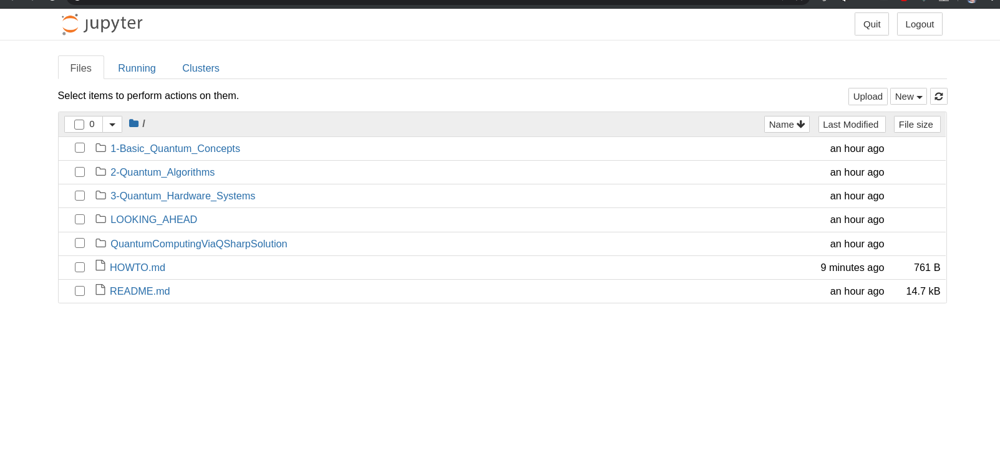
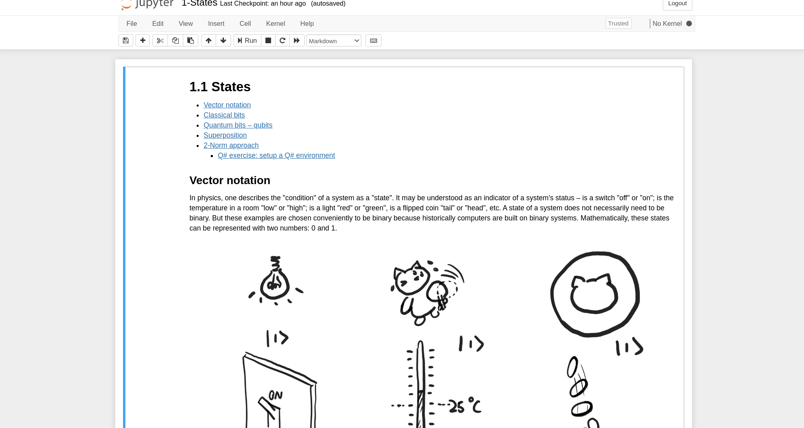

# How to read this book


**Installing Jupyter Notebook to ideally set up for this repo**

While using the Microsoft quantum community book you might notice some discrepancies in rendering equations. To prevent this use Jupyter Notebooks locally. Use the following instructions to do so: 

## Requirements:

Operating system: Windows 10, Linux, MacOS

Runtime: Python 3.3+


## Installing Jupyter with pip

Before you install jupyter with pip, make sure you are on the newest version of pip.

```pip3 install --upgrade pip```

To install the Jupyter Notebook use the following command

```pip3 install jupyter```

For an always current installation guide of Jupyter Notebook follow the official instructions. (https://jupyter.readthedocs.io/en/latest/install.html) 

Now clone the community_book GitHub repository.

```git clone git@github.com:KittyYeungQ/community_book.git```

From the command line navigate to the cloned community_book folder via 

```cd ~/path/to/community_book/```

To run the notebook use

```jupyter notebook```


The jupyter notebook should run at localhost:8888. Usually the browser opens this url automatically.  



Now you can open every chapter by navigating through the folder structures.

